Installation
============

Requirements
------------

Ember-CSI has the following requirements:

- Operating system: A Red Hat Linux distribution (support for other distributions is possible but not currently provided by the project):
  - Centos 7 and Centos 8
  - RHEL 7 and RHEL 8
  - Fedora

- Container Orchestrator: Both Kubernetes and OpenShift are supported:
  - Openshift: Recommended version 4.4 or newer. Supported from version 3.10 onward.
  - Kubernetes: Recommended version 1.17 or newer. Supported from version 1.11 onward.

- Storage solution: Access and credentials to a `supported storage solution <index.html#supported_drivers>`_.

- Network: Network connections must be setup appropriately.
  - Controller nodes: Must have access to the storage management interface.  Some drivers require access to the storage data network as well.
  - Worker nodes: Must have access to the storage data network.

- Services: Depending on the driver and the configuration we may need additional services running on worker nodes and in some drivers controller nodes.

  - iSCSI: For iSCSI drivers the iSCSI initiator, `iscsid` provided by the `iscsi-initiator-utils` package must be configured and running on the host.

  - Multipathing: When selecting multipathing on iSCSI and FC drivers we'll need to have `multipathd`, provided by the `device-mapper-multipath` package, configured and running on the host.

OpenShift
---------

To eliminate configuration and deployment complexities and the errors that come with them, the recommended mechanism to deploy Ember-CSI is using its operator, which makes installing Ember-CSI a simple and intuitive process.

After logging in the OpenShift console as an administrator we go to the OperatorHub:

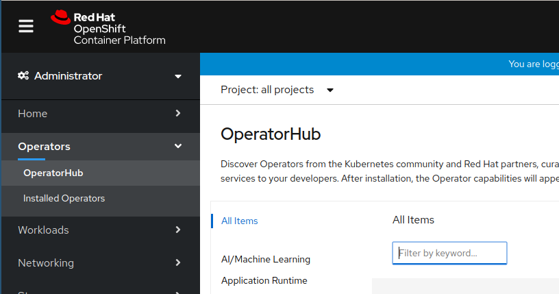

Then we search for the Ember-CSI operator and click on it:

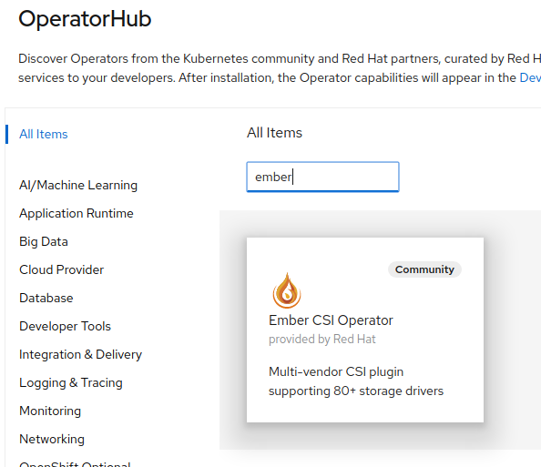

If we are installing the Community Operator we'll be required to confirm that we understand the implications.  We click ``Continue``:

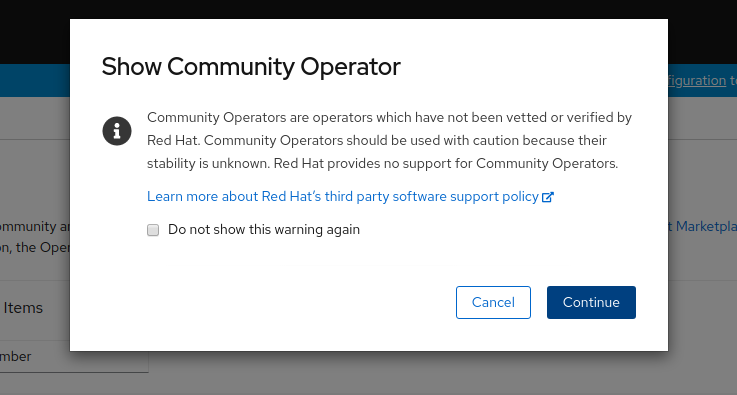

And we are presented with the Ember-CSI Operator page, where we click ``Install``:

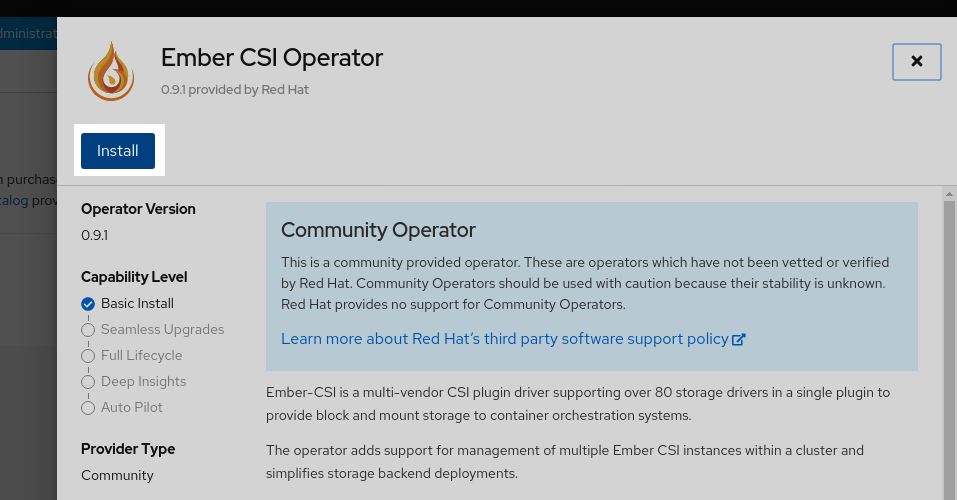

And then ``Install`` again:

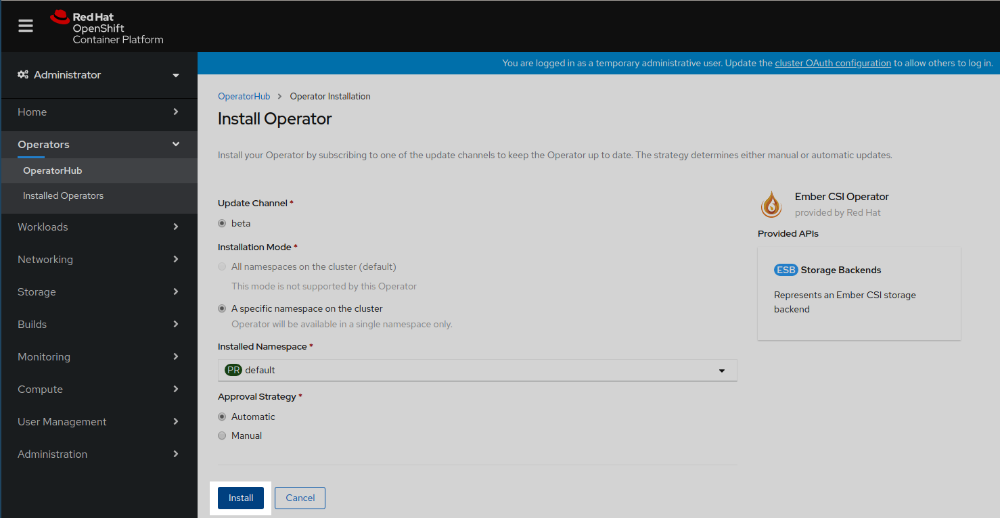

This will trigger the download and execution of the operator container image. It will take a couple of seconds, and in the meantime we'll see that the installation is in progress and maybe a couple of weird entries saying at the beginning:

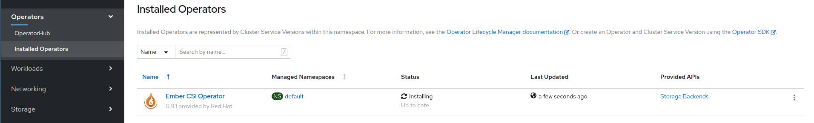

Once the operator reaches the ``Succeeded`` status we click on it:

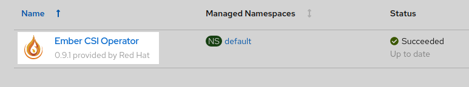

Inside the Ember-CSI operator page we create a new ``Storage Backend`` instance:

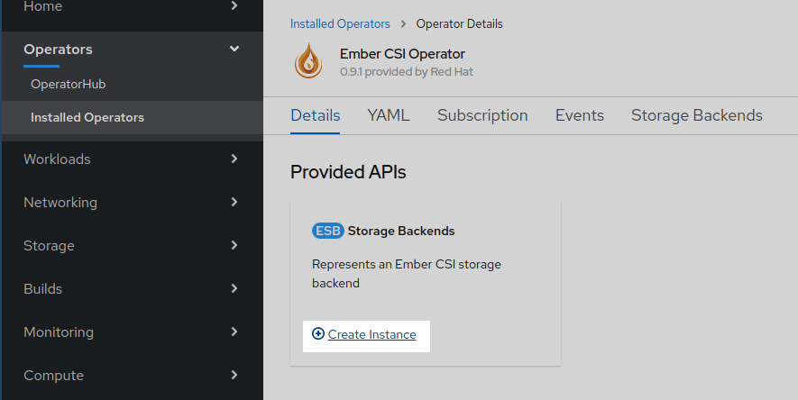

Backends can be configured using YAML, but this is a cumbersome process, so it's usually only used on automated processes such as CI systems, and the Ember-CSI team recommends using the form interface when doing things manually, which is the default on OpenShift 4.5.

In the form we should change the *name* field from *default* to a unique and meaningful name to identify this backend. Then go to the *Driver* dropdown and select the name of our storage backend.  After selecting the appropriate driver the relevant configuration options for the selected driver will be displayed.

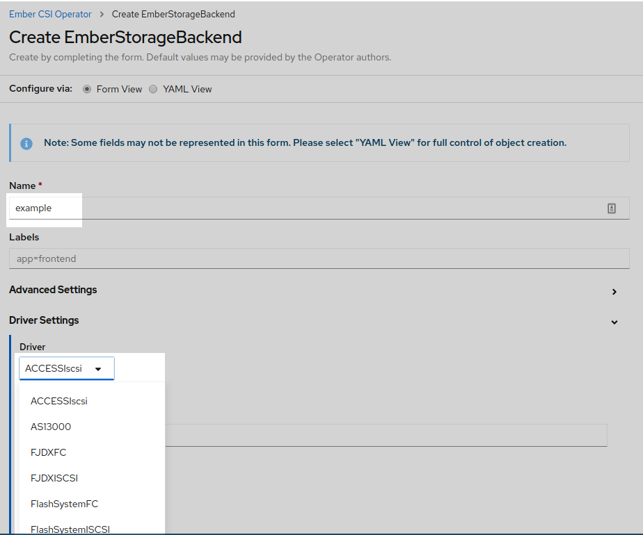

After setting the configuration options we click *Create* at the botom of the page:

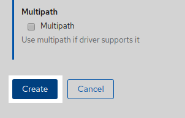

And a new *EmberStorageBackend* entity will be created.  Don't wait for the *Status* to change, since it won't:

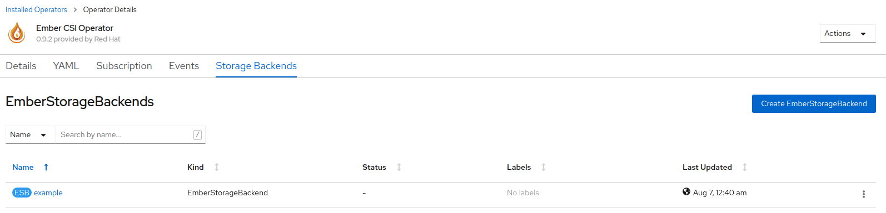

We can see that the deployment is complete going to *Stateful Sets*, *Daemon Sets*, and *Replica Sets* pages in the *Workloads* section to see that the deployed pods are running:

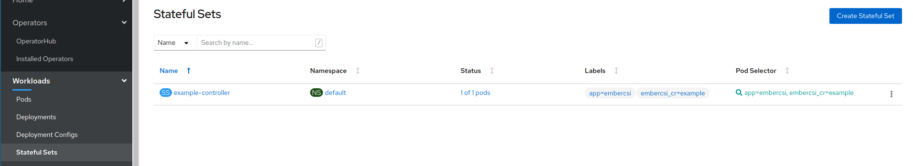

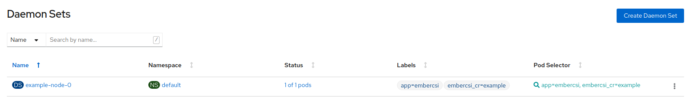

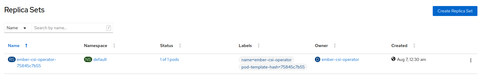

We can also check that a new *Storage Class* has been created in *Storage* > *Storage Classes*. The name of the new class will be *example.ember-csi.io* where *example* will be the name we gave to the *Storage Backend* in the form:

.. image:: img/install/15-StorageClass.png
   :class: boxed-img
   :align: center

We can set this *Storage Class* as the default class by going to its actions and selecting *Edit Annotations*:

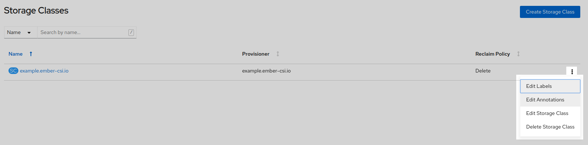

And then adding key `storageclass.kubernetes.io/is-default-class` with the value of `true`.

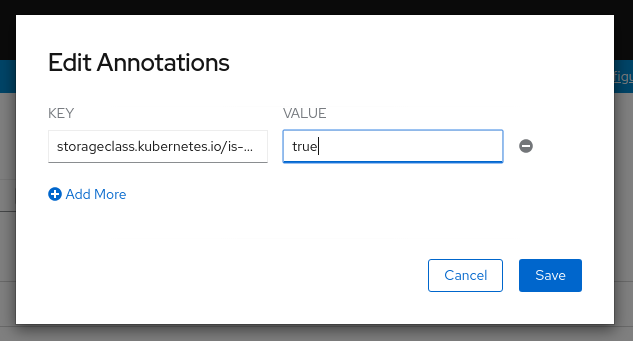

.. warning:: If we already have a default and we want to change it to this one, we'll need to modify the current default by removing the annotation or setting it to `false`.

If we have configured everything right we'll now be able to use our storage solution into OpenShift using the new ``StorageClass`` that was created by the operator.  In the `usage section <usage.html>`_ there is information on how to use the new Storage Backend.

If you see problems in the new *Stateful*, *Daemon*, or *Replica Sets*, please refer to the `troubleshooting guide <troubleshooting.html>`_ for details on how to resolve installation issues.
