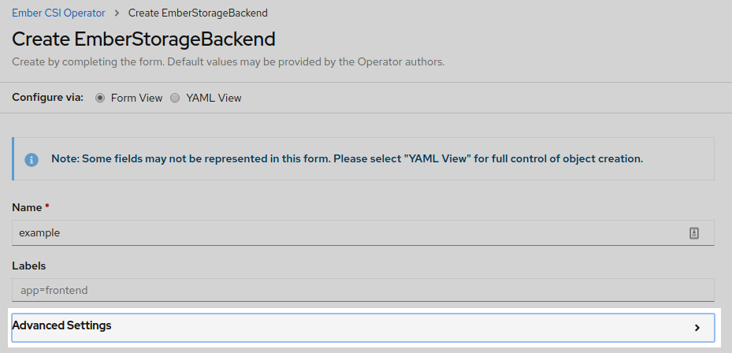
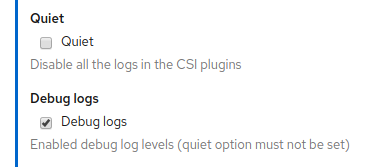

Troubleshooting
===============

The main tool used to investigate issues between Ember-CSI and the Orchestrator are OpenShift/Kubernetes status and logs.

Ember-CSI runs 2 types of services, one is the controller and the other is the node type.  While the controller takes care of the management operations (create, delete, map/unmap, snapshots, etc.) the node mostly takes care of doing the local attach and detach on the hosts that are running the pods.

These services follow the CSI specification, exposing all their operations through a gRPC interface that needs to be translated into OpenShift/Kubernetes objects.  The sidecars present in the Ember-CSI pods are responsible for the translation.

Status
------

The first thing we need to do when we encounter an issue is make sure that all the containers in the Ember-CSI pods, the driver container and the sidecars, are running and that their restart counts are not increasing.

Instead of looking at all the pod in our deployment we can use the fact that the operator adds the ``embercsi_cr`` label to filter for the pods of a specific backend:

.. code-block:: shell

   $ # On OpenShift
   $ oc get pod -n <cluster-namespace> -l embercsi_cr=<backend_name> -o wide

   $ # On Kubernetes
   $ kubectl get pod -n <cluster-namespace> -l embercsi_cr=<backend_name> -o wide

Or the pods for all the Ember-CSI backends:

.. code-block:: shell

   $ oc get pod -n <cluster-namespace> -l embercsi_cr -o wide

When using an iSCSI or FC backend we need to make sure that the system daemons required for the connections are running and they are not reporting errors if we encounter issues on the following operations:

- Creating a volume from a source (volume or snapshot): On some drivers this is not a backend assisted operation, so the resources in the backend need to be accessed in the controller node.

- Creating or destroying a pod that uses an Ember-CSI volume:

If we are running the daemons as systemd services on baremetal, we can check them running:

.. code-block:: shell

   $ systemctl status iscsid multipathd
   $ sudo journalctl -u iscsid -u multipathd

On the other hand, if we are running the daemons in the foreground inside containers, we'll have to check the containers status and logs themselves.

Logs
----

One of the most versatile tools to debug issues in general are the logs, and Ember-CSI is no different.

The logs we'll have to check will depend on the operations that are failing:

- If it's creating/deleting a volume or creating/deleting a snapshot, we should look into the Ember-CSI controller pod, primarily the driver container.

- Creating/destroying a pod that uses a volume is one of the most complex operations, and it requires the controller pod, the node pod, and the kubelet, so we'll have to look into all their logs.

By default Ember-CSI logs will be on *INFO* level and they can only be changed to *DEBUG* when creating the Storage Backend in the *Advanced Settings* section:

By setting the *Debug logs* checkbox:

CSC
---

When debugging issues on complex flows, it's very convenient to be able to test the individual tasks that form the flows. For that purpose the Ember-CSI has created containers with the ``csc`` tool for each of the CSI specs.

The ``csc`` tool allows us to execute specific CSI operations directly against an Ember-CSI service.

For example, we could run a create volume operation completely bypassing the Orchestrator.  This way we could focus on the Ember-CSI code itself and the interactions with the storage solutions, removing the interactions with other elements such as OpenShift/Kubernetes scheduler and the sidecars.

Neither Kubernetes nor OpenShift allows adding containers to a running Pod, but there is an `Alpha feature called Ephemeral Containers <https://kubernetes.io/docs/concepts/workloads/pods/ephemeral-containers/>`_ designed for debugging purposes that can do it.

We need to have the feature gate ``EphemeralContainers`` enabled in our Orchestrator. Specifically on the API, Scheduler, and Kubelet: ``--feature-gates=EphemeralContainers=true``.

If it's enabled we can add an Ephemeral container with the ``csc`` command to our running pod.

For the following steps we'll assume we have used the name ``example`` as our Backend name.

First we check the CSI version that is using Ember-CSI:

.. code-block:: shell

   $ oc describe pod example-controller-0|grep X_CSI_SPEC_VERSION
   X_CSI_SPEC_VERSION:        1.0

Now that we know we are running CSI v1.0 we know the ``csc`` container we want to use: *embercsi/csc:v1.0.0*

With that we can write the ``csc.json`` file to add the Ephemeral Container:

.. code-block:: json

   {
     "apiVersion": "v1",
     "kind": "EphemeralContainers",
     "metadata": {
       "name": "example-controller-0"
     },
     "ephemeralContainers": [
       {
         "command": ["tail"],
         "args": ["-f", "/dev/null"],
         "image": "embercsi/csc:v1.0.0",
         "imagePullPolicy": "IfNotPresent",
         "name": "csc",
         "stdin": true,
         "tty": true,
         "terminationMessagePolicy": "File",
         "env": [ {"name": "CSI_ENDPOINT",
                   "value": "unix:///csi-data/csi.sock"} ],
         "volumeMounts": [
             {
                 "mountPath": "/csi-data",
                 "mountPropagation": "HostToContainer",
                 "name": "socket-dir"
             }
         ]
       }
     ]
   }

And, assuming we don't have any other Ephemeral Containers, we add it by replace the current value:

.. code-block:: shell

   $ oc replace --raw /api/v1/namespaces/default/pods/example-controller-0/ephemeralcontainers -f csc.json

If we don't want to create a file we can do a one-liner by using ``echo`` a piping it to the ``oc replace`` command and setting the file contents to *stdin* with ``-f -``.

Now that we have added the Ephemeral Container we can confirm it is running looking at the description of the controller pod and going to the ``Ephemeral Containers`` section and checking the ``State``:

.. code-block:: shell

   $ oc describe pod example-controller-0

   ...

   Ephemeral Containers:
     csc:
       Container ID:  docker://e52d25a53af77a6f660d171504aa9dc6c2c3d405a9af20451054fadba969c84a
       Image:         embercsi/csc:v1.0.0
       Image ID:      docker-pullable://embercsi/csc@sha256:5433e0042725398b9398be1b73d43cc96c77893cf4b77cafca77001fa533cd29
       Port:          <none>
       Host Port:     <none>
       Command:
         sh
       State:          Running
         Started:      Thu, 13 Aug 2020 14:18:23 +0000
       Ready:          False
       Restart Count:  0
       Environment:
         CSI_ENDPOINT:  unix:///csi-data/csi.sock
       Mounts:
         /csi-data from socket-dir (rw)

When we have the shell container running we can run ``csc`` commands by attaching to the shell. For example to see the help:

.. code-block:: shell

   $ oc attach -it example-controller-0 -c csc
   If you don't see a command prompt, try pressing enter.
   / # csc
   NAME
       csc -- a command line container storage interface (CSI) client

   SYNOPSIS
       csc [flags] CMD

   AVAILABLE COMMANDS
       controller
       identity
       node

   Use "csc -h,--help" for more information

.. warning:: Just like with normal containers, once you add an Ephemeral Container to a pod you cannot remove it, so be sure to detach from the container and not ``exit`` the shell, or the container will no longer be running and you won't be able to use it (you cannot run ``exec`` on an Ephemeral Container).

.. note:: To detach from the ``csc`` container shell you must type the escape sequence *Ctrl+P* followed by *Ctrl+Q*.

CRDs
----

Ember-CSI uses OpenShift/Kubernets etcd service to store metadata of its resources in the form of CRDs.  Existing CRDs are:

- Volume: Stores each volume's status as well as the information necessary to locate them in the storage solution.
- Snapshot: Stores the information necessary to locate each snapshot in the storage solution.
- Connection: Stores the connection information needed for a node to connect to a volume.
- KeyValue: Stores the connector information needed to map the volumes to the nodes on the storage solution.

These CRDs are just JSON dictionaries with all the information Ember-CSI needs to operate, and in some cases it can be useful to examine them to see internal information.
