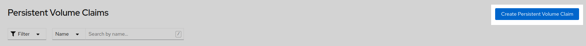
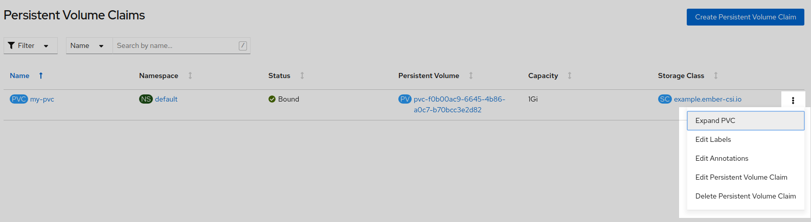
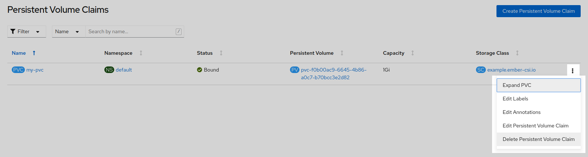
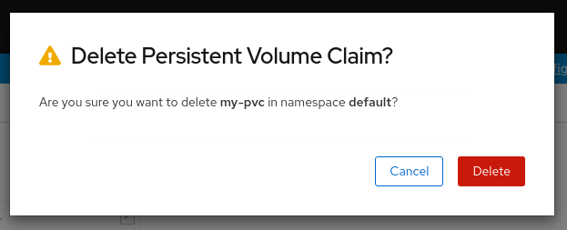

Usage
=====

Now that we have completed the `installation <installation.html>`_ of Ember-CSI, we can manage our Storage Backend in our Container Orchestrator.

In this section examples will be provided both for the OpenShift Web Console and for the command line in the form of YAML manifests.

The same YAML manifests work on Kubernetes and OpenShift, the only difference is the command to invoke.  For Kubernetes we'll use `kubectl`` and ``oc`` for OpenShift:

.. code-block:: shell

   $ # On OpenShift
   $ oc apply -f manifest.yaml

   $ # On Kubernetes
   $ kubectl apply -f manifest.yaml

NOTE: In all the examples we'll assume we created the *Storage Backend* with the default name *example* using the Operator, and that the *Storage Class* automatically created is *example.ember-csi.io*

Volume creation
---------------

We can create 2 types of volumes, Block and File, and both are supported by Ember-CSI, but OpenShift forms don't allow specifying the type on creation, so they always default to File.

To create a volume we go to *Storage* > *Persistence VolumeClaims* and click on *Create Persistent Volume Clain*.

On the next page we must select the *Storage Class* created by the operator, give the *PVC* a unique name, select the *Access Mode* and the size.

.. image:: img/usage/02-create-pvc.png
   :class: boxed-img
   :align: center

.. warning:: Ember-CSI only supports the Shared Access (RWX) *Access Mode* for Block volumes.

.. note:: OpenShift doesn't support selecting the type of volume we want to create, so we'll have to use YAML if we want to create a Block volume.

To select the type of volume we want in our YAML we'll use the ``volumeMode`` parameter.  Acceptable values are ``Block`` and ``Filesystem``, the default being ``Filesystem``.

Example of a *PVC* manifest using this default:

.. code-block:: yaml

   apiVersion: v1
   kind: PersistentVolumeClaim
   metadata:
     name: my-pvc
   spec:
     accessModes:
     - ReadWriteOnce
     resources:
       requests:
         storage: 1Gi
     storageClassName: example.ember-csi.io

Similar *PVC* example for a Block volume:

.. code-block:: yaml

   apiVersion: v1
   kind: PersistentVolumeClaim
   metadata:
     name: my-block-pvc
   spec:
     accessModes:
       - ReadWriteOnce
     volumeMode: Block
     resources:
       requests:
         storage: 3Gi
     storageClassName: example.ember-csi.io

Using volumes
-------------

Using a dynamically created *PVC* is as easy as adding a ``persistentVolumeClaim`` parameter with the ``claimName`` in the ``volumes`` section of our manifest:

.. code-block:: yaml

   kind: Pod
   apiVersion: v1
   metadata:
     name: my-app
   spec:
     containers:
       - name: my-frontend
         image: busybox
         volumeMounts:
         - mountPath: "/data"
           name: my-csi-volume
         command: [ "sleep", "1000000" ]

     volumes:
       - name: my-csi-volume
         persistentVolumeClaim:
           claimName: my-pvc

Expanding Volumes
-----------------

We can expand already created volumes to have more space without losing existing data.  The operation is called *expanding*, and it's very straightforward.  In the web console we just go to the actions we can do in the *PVC* and select *Expand PVC*.

Then write the new size, that must be greater or equal than the existing size, and click on *Expand*.

.. image:: img/usage/04-expand-size.png
   :class: boxed-img
   :align: center

When using the command line and a YAML manifest, we just need to modify the original contents with the new ``storage`` size, and it's important to use ``apply`` and not ``create`` on the command line:

.. code-block:: yaml

   apiVersion: v1
   kind: PersistentVolumeClaim
   metadata:
     name: csi-pvc
   spec:
     accessModes:
       - ReadWriteOnce
     resources:
       requests:
         storage: 2Gi
     storageClassName: example.ember-csi.io

Volume cloning
--------------

Volume cloning is the process of creating a new volume with the same contents as the source volume.

The new volume must be greater or equal in size as the original one and the source volume must be specified in the ``dataSource`` parameter, which is not available yet in the OpenShift Web Console, so we'll have to use YAML to do it:

.. code-block:: yaml

   apiVersion: v1
   kind: PersistentVolumeClaim
   metadata:
     name: cloned-vol
   spec:
     storageClassName: example.ember-csi.io
     volumeMode: Block
     dataSource:
       name: my-block-pvc
       kind: PersistentVolumeClaim
     accessModes:
       - ReadWriteOnce
     resources:
       requests:
         storage: 5Gi

Snapshot creation
-----------------

During the deployment phase the Operator also creates a *VolumeSnapshotClass* for our  Storage Backend with the same name as the *StorageClass* so we can easily create snapshots.

.. note:: As of OpenShift 4.5 the Web Console doesn't have support for snapshots, but the necessary code is being merged in master, so it will most likely be available in OpenShift 4.6.

So we'll have to use a YAML manifest and use the ``source`` parameter to define the volume we want to snapshot.

.. code-block:: yaml

   apiVersion: snapshot.storage.k8s.io/v1beta1
   kind: VolumeSnapshot
   metadata:
     name: my-snapshot
   spec:
     volumeSnapshotClassName: example.ember-csi.io
     source:
       persistentVolumeClaimName: my-block-pvc

Restoring a snapshot
--------------------

To restore an already created snapshot we'll have to create a new volume and use our snapshot as its source.

The new volume must be of greater or equal size than the snapshot.

.. code-block:: yaml

   apiVersion: v1
   kind: PersistentVolumeClaim
   metadata:
     name: restored-snapshot
   spec:
     storageClassName: example.ember-csi.io
     dataSource:
       name: my-snapshot
       kind: VolumeSnapshot
       apiGroup: snapshot.storage.k8s.io
     accessModes:
       - ReadWriteOnce
     resources:
       requests:
         storage: 3Gi

Volume deletion
---------------

The *Storage Class* created by the operator is defined with a ``Delete`` ``ReclaimPolicy``, which means that once we delete the *PVC* the dynamically created *PV* will be deleted.

We can delete a volume in the OpenShift Web Console by going to *Storage* > *Persistence VolumeClaims* and look for the *PVC* we want to delete and in its actions we select *Delete Persistent Volume Claim*:

Deletion requires confirmation, so we'll have to click on the *Delete* volume:

Deleting the *PVC* from the command line can be done using the name:

.. code-block:: shell

   $ oc delete pvc my-block-pvc

Or with the manifest we used to create it:

.. code-block:: shell

   $ oc delete -f manifest.yaml

Snapshot deletion
-----------------

.. note:: As of OpenShift 4.5 the Web Console doesn't have support for snapshots, but the necessary code is being merged in master, so it will most likely be available in OpenShift 4.6.

Deleting a *VolumeSnapshot* from the command line can be done using the name:

.. code-block:: shell

   $ oc delete pvc my-snapshot

Or with the manifest we used to create it:

.. code-block:: shell

   $ oc delete -f manifest.yaml
